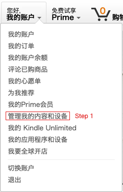
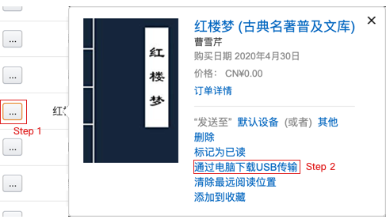
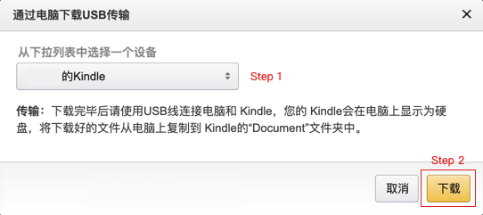
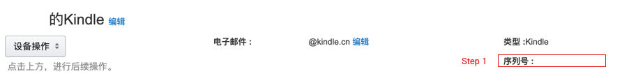
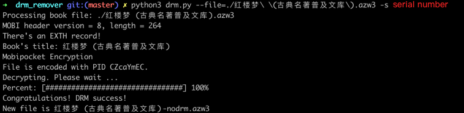
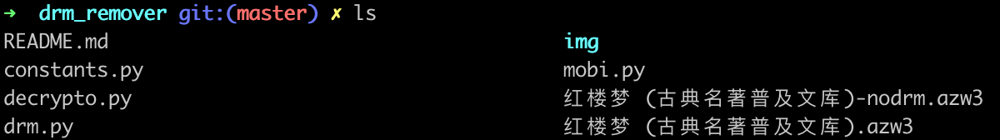
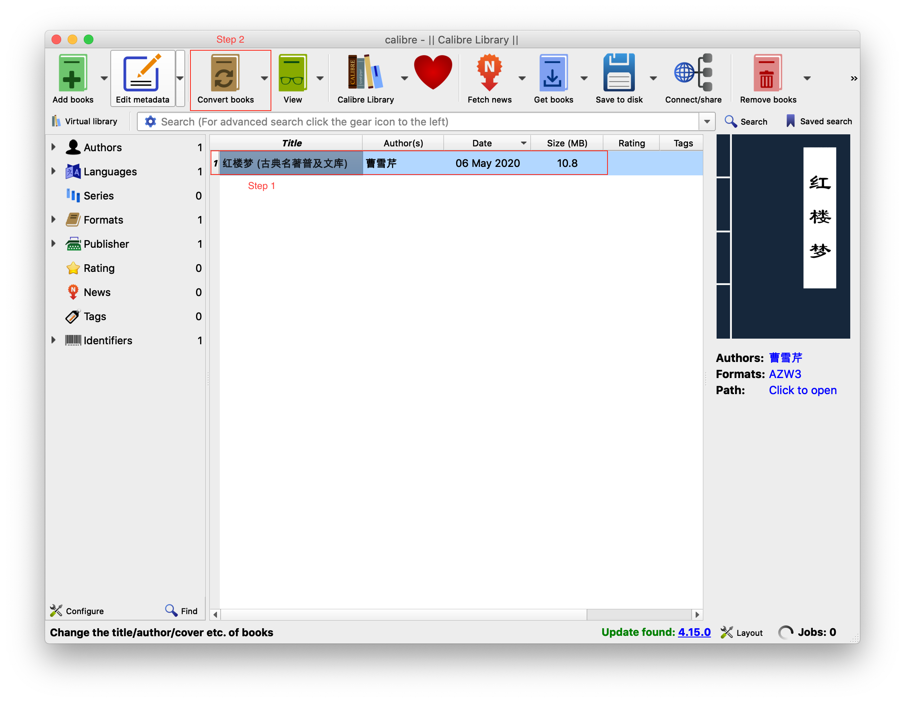

# 破除Kindle电子书的DRM

由于Mac系统的升级，不再兼容老版本的Kindle for Mac，而新版本的下载的ebook的格式为kcr，kindle上的ebook格式为kfx，导致无法在Mac上对已经购买的ebook破除DRM限制，从而不能利用calibre进行格式转换。

### 人生苦短，我用Python

不能将在kindle上购买的ebook转换成pdf格式，这大大的限制了对书籍的可操作性，于是在网上查找相关方法，可始终没有找到Mac上的正确方案，而Windows上只需要退回老版本即可。

根据之前的格式转换流程来看，最重要的步骤就是去除DRM(Digital Rights Management)，既然没有现成的方案，那就用代码去实现吧，Java太臃肿，C太难，那就Python吧，毕竟人生苦短啊！

### 欲求PDF，必得AZW(3)

* 下载azw3文件  

    登录[亚马逊](https://www.z.cn)，进入`管理我的内容和设备`页面，如下图所示。

  在`内容`标签下，选择需要转换的书籍，并点击`通过电脑下载USB传输`，如下图所示。
  

  先从下拉列表中选择kindle设备，然后点击`下载`按钮，如下图所示。

* 获取序列号
   
    经过上一步，已经得到了azw3文件，接着需要获取kindle设备的序列号。先将标签从`内容`切换到`设备`，并选择kindle设备，复制序列号，如下图所示。
 

### 命令破壳，界面转换

* 命令运行
  
  | 参数 | 说明 | 使用 |
  | :---: | :---: | :---: |
  | file | azw3文件路径 | -f \*.azw3 或者 --file=\*.azw3 |
  | serial | kindle序列号 | -s xxx 或者 --serial=xxx |
  | out | 输出目录(可选，默认当前目录) | -o xxx 或者 --out=xxx |
  
  该脚本采用Python3编写，入口文件为`drm.py`，下图演示了对`红楼梦 (古典名著普及文库).azw3`去除DRM的命令，其中serial number为之前复制的kindle设备序列号。
 

  运行完命令后，在当前目录下得到了名为`红楼梦 (古典名著普及文库)-nodrm.azw3`的文件，结果如下图所示。
  

* calibre转换

  打开`Calibre`，将得到的`红楼梦 (古典名著普及文库)-nodrm.azw3`的文件拖拽到应用中(或者通过`Add books`进行添加)，点击`Convert books`按钮，即可转换为包含PDF在内的多种电子书格式，下图是一个简单示例。
  
